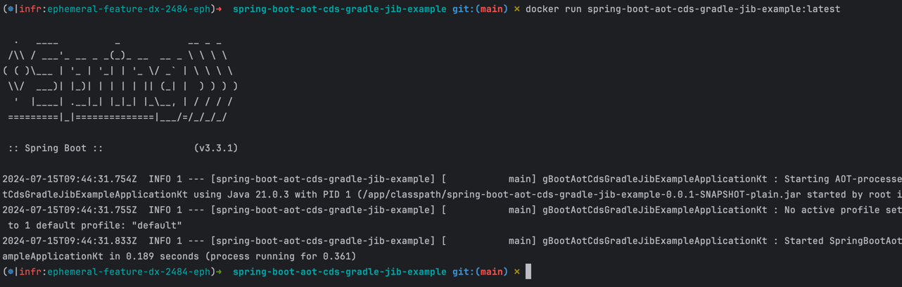

# An example of how you can configure CDS and Spring AOT with Gradle and Jib

This is a simple example of how you can make your application start-up time more efficient with the following technologies:

* Spring Boot 3.3.+
* Spring AOT
* Application CDS
* Jib
* Gradle build tool

It's a follow-up to [Sebastien's demo app based on maven](https://github.com/sdeleuze/spring-boot-cds-demo)

Please watch [the video from Spring I/O 2024](https://youtu.be/H2tM7EClyx8?si=hHtYN27mBGk_ip4r) to know more about the CDS technology.

## How to build

```shell
./build-cds.sh
```

## How to run 

```shell
docker run spring-boot-aot-cds-gradle-jib-example:latest
```

Expect the start-up time is minimal **w/o usage of GraalVM**



### Troubleshooting and hits

* Read [the general Jib CDS issue for the details and stories of others](https://github.com/GoogleContainerTools/jib/issues/2471)
* Currently, JIB doesn't allow extending `jib.container.jvmFlags` so you have to override all of them, see [the issue](https://github.com/GoogleContainerTools/jib/issues/4270)
* You must run the actual image in order to pass by potential errors due to a wrong CDS archive
* Setup Spring runtime environment as much as close to the actual runtime environment, i.e. set the same properties for the instrumentation run (cds preparation) as you have in the actual runtime environment
  * e.g. properties like `SPRING_PROFILES_ACTIVE=prod` it's crucial to prebuild the AOT classes the same way they initialize on the actual environment
* Make sure `build/libs/cds/application.jsa` exists before you build the final image
* The JVM runtime flag `-Xshare:on` will break (stop) the deployment if the CDS archive doesn't exist, use it wisely on production